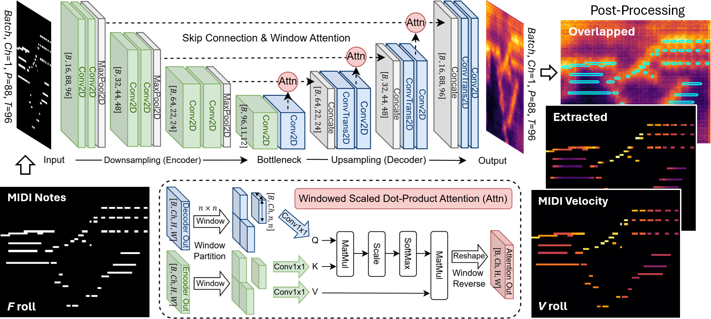
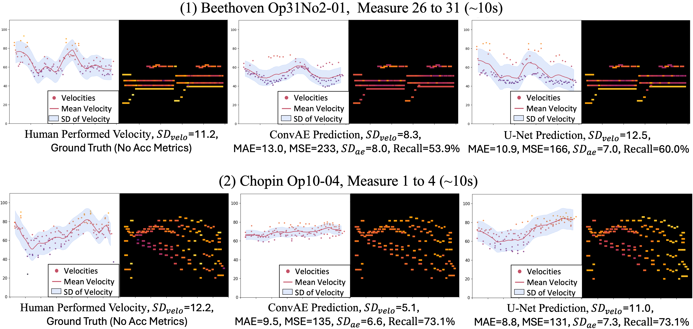

# midi-velocity-colorizer
PyTorch implementation for filling MIDI velocities from given MIDI notes. The model is an U-Net image colorizor &amp; trained on expert performances from the Piano-e-Competition (MAESTRO dataset). It can work on all instrumental MIDI, but best expressiveness on piano (will train with other instruments in future).



This repo provides supplementary materials for our paper:
**"Filling MIDI Velocity using U-Net Image Colorizer"** submitted to CMMR2025.

- A Google Colab notebook in progress to help users without code environment. You can upload your MIDI then download it with MIDI velocity filled, instead of local running our `interface,ipynb`.

## 📁 Code Contents
- `train.py` — model training entry point
- `evaluation.ipynb` — reproduce Tables 2 & 3 quantitative results in our paper
- `interface.ipynb` — colorize & visualize the midi; reproduce Figures 1–4 in our paper
- `results/` - directory for model, outputs and audio demos
  - [checkpoints.zip](https://drive.google.com/file/d/13ejPI7U-Dhlnt0h_WSkwrWyR146TjJzl/view?usp=drive_link) download and extract here to interface with our trained model
  - [subjective_test_audio.rar](https://drive.google.com/file/d/1rLeCHIGh3iARHRpAPhsfFeIvudK3XuYZ/view?usp=sharing) listening test samples generated from our colorized MIDI using PianoTeq 8 (see Section 5.2 of the paper)
- `compare/` — Flat model and [Kim2023's Seq2Seq]((https://github.com/sappho192/midi-velocity-infer-v2/)).

## 📝 Additional Materials
- [WandB workspace](https://wandb.ai/zhanh-uwa/2025_cmmr) (public available, but need login wandB first)
- [WandB report](https://api.wandb.ai/links/zhanh-uwa/wpzvcb76)
  - This wandb report includes quantitative results, refer to Tables 2 & 3 in the paper.
  - This wandb report includes hyperparameter search **not included in the paper**.

## 0. Hyperparameter Setup

All training settings are defined in `conf/config.yaml`.  
- Some data filtering operations were implemented but not used in our experiments.
- To reproduce our results, please refer to the training logs and parameter tracking in our WandB workspace.


## 1. Dataset Setup

Please download the following datasets and place them under the `/dataset` folder:
- [MAESTRO v3.0.0](https://magenta.tensorflow.org/datasets/maestro)
- [Saarland Music Data v2](https://zenodo.org/records/13753319)


## 2. Environment Setup

Tested on:
- Ubuntu 20.04 (CUDA 12.0)
- Ubuntu 22.04 (CUDA 12.2)

#### Using Conda & Pre-built Env (recommended):
```bash
conda env create -f environment.yaml
```

#### Manual Build Your Env:
```bash
conda create --name velocity_pred python=3.11
conda install pytorch=2.2.2 torchvision=0.17.2 torchaudio=2.2.2 pytorch-cuda=12.1 -c pytorch -c nvidia
conda install lightning -c conda-forge
```

## 3. WandB Integration (optional)

We use [Weights & Biases](https://wandb.ai) for experiment tracking.

```bash
wandb login
```

If preferred, you can switch to TensorBoard by modifying `train.py`.

 

## 4. Train the Model

Edit training options in `conf/config.yaml`. Then run:

```bash
# Re-implemented ConvAE baseline
python train.py exp.test_dataset="MAESTRO" matrix.seg_time=10 ae.model="ConvAE" loss.type="BCELoss" loss.mask='element_wise' loss.weight='u_shape' loss.cosim=0.2 exp.save_k_ckpt=10

# Proposed U-Net with 2x2 attention window
python train.py exp.test_dataset="MAESTRO" matrix.seg_time=10 ae.model="UNet" ae.ablation="attn" ae.attn_window=2 loss.type="BCELoss" loss.mask='element_wise' loss.weight='u_shape' loss.cosim=0.2 exp.save_k_ckpt=10
```

 

## 5. Evaluate the Model (Tables 2 & 3)

Use `evaluation.ipynb` to reproduce our results, please download & unzip our model `checkpoints.zip` to `results/checkpoints` folder.

For other models' results in Tables 2&3:
  - Flat model: `compare/Flat_model/flat_evaluation.ipynb`
  - Kim2023 Seq2Seq model: `compare/Kim2023_model/seq2seq_evalaution.ipynb`

 

## 6. Interface & Demo (Figures 1–4)

Use `interface.ipynb` to process & visualise the MIDI with our trained models, you will obtain the MIDI file accordingly. Following are example from [Human, ConvAE, UNet], find more examples in our `interface.ipynb`, and demos in `subjective_test_audio.rar`.




 
